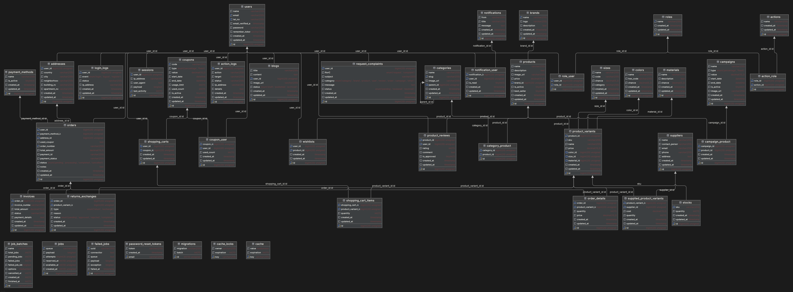

## Database Schema

### User Management
- `users`: Stores user account information
- `roles`: Defines user roles (e.g., customer, admin)
- `role_user`: Links users to their roles
- `addresses`: Stores user shipping addresses

### Product Management
- `products`: Main product information
- `product_variants`: Specific variants of products
- `categories`: Product categories
- `brands`: Product brands
- `suppliers`: Suppliers
- `stocks`: Inventory management for product variants
- `colors`: Colors that available for product variants
- `sizes`: Sizes that available for product variants
- `materials`: Materials that available for product variants

Little Note: The "chance" columns in the colors, sizes, and materials tables are used for the seeder in the web project. These columns ensure that not every possible combination of values is generated, allowing for more realistic and controlled data generation.

### Order Processing
- `orders`: Main order information
- `order_details`: Specific items in each order
- `invoices`: Order invoices
- `payment_methods`: Available payment methods

### Shopping Experience
- `shopping_carts`: User shopping carts
- `shopping_cart_items`: Items in shopping carts
- `wishlists`: User wishlists

### Reviews and Ratings
- `product_reviews`: User reviews and ratings for products

### Promotions and Marketing
- `coupons`: Discount coupons
- `campaigns`: Marketing campaigns
- `campaign_product`: Links campaigns to products

### Customer Support
- `request_complaints`: Customer requests and complaints

### Logging and Analytics
- `action_logs`: Logs of user actions
- `login_logs`: User login/logout events

### Additional Features
- `blogs`: Blog posts
- `notifications`: System notifications
- `returns_exchanges`: Product returns and exchanges

And more tables for a normalized e-commerce database, checking the diagram for more content (mostly pivots) is recommended. 
